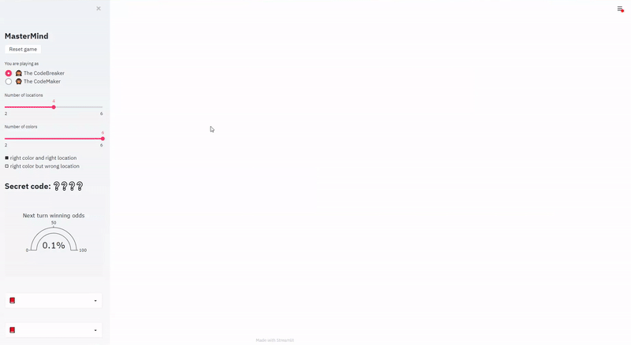

[](https://share.streamlit.io/a-slice-of-py/mastermind/app.py)

# Streamlit Mastermind

[Mastermind](https://en.wikipedia.org/wiki/Mastermind_(board_game)) is a code-breaking game for two players, here implemented via Python with a Streamlit interface.



Live version of the app can be found hosted on [Streamlit Sharing](https://blog.streamlit.io/introducing-streamlit-sharing/) (_you can click on the Streamlit badge on the top of this page_) or[Heroku](https://streamlit-mastermind.herokuapp.com) (_thanks to [S Ahmad](https://towardsdatascience.com/deploy-streamlit-on-heroku-9c87798d2088) and [hannahyan](https://dev.to/hannahyan/getting-started-in-deploying-interactive-data-science-apps-with-streamlit-part-2-3ob) for the wonderful deployment tutorials!_).

## Installation

Use the package manager [pip](https://pip.pypa.io/en/stable/) to install `mastermind` in edit mode.

```python
>>> pip install -e . # in the root folder (look for setup.py)
```

## Project tree structure

```python
root/
|
├── mastermind/
│   │
|   ├── __init__.py
│   │
|   ├── core/
│   │   ├── __init__.py
│   │   └── mastermind.py
│   │
|   └─ dashboard/
│       ├── __init__.py
│       ├── session_state.py
│       └── st_rerun.py
|
├── .dockerignore
├── .gitignore
├── app.py
├── Dockerfile
├── Procfile
├── README.md
├── requirements.txt
├── setup.sh
└── setup.py
```

## Usage

Install [streamlit](https://docs.streamlit.io/) via `pip` and execute the following in the root folder to run Streamlit app (by default on port 8501):

```python
>>> streamlit run app.py
```

## Authors

- **Silvio Lugaro**, _silvio.lugaro@gmail.com_